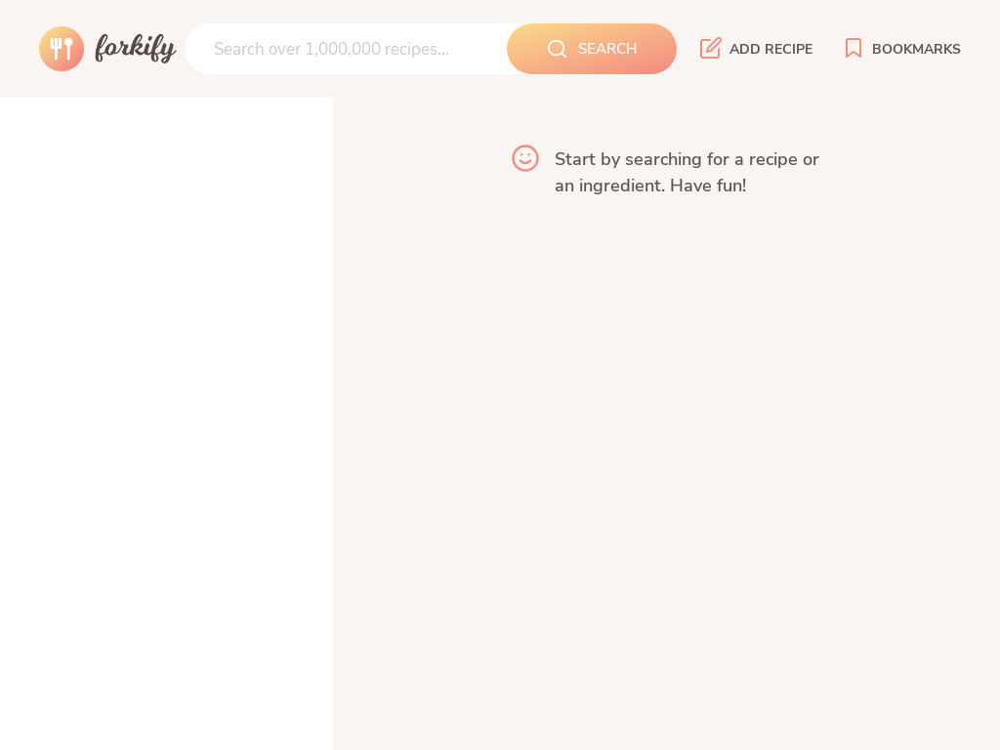

<div align="center" id="top"> 
  
</div>

<hr>
<br>

# Forkify

[](./src/img/g1.gif)

A beautiful recipe search engine made with modern JavaScript features 😋 

the application support searching for recipe, bookmark recipe, and custom recipe uploads.

It's built with modern JavaScript features and the MVC architecture.

## Project Setup

Clone the Project 
```bash
git clone https://github.com/Ahmedashref26/Forkify.git
``` 
Install the dependencies 
```bash
npm install
```

---
## Usage

Start the development server.

```bash
npm start
```

View app at

- [http://localhost:3000](http://localhost:3000)

What you can do with this application

- search for recipes.
- bookmark recipes.
- upload recipes

[](./src/img/p2.jpg)
[](./src/img/p1.jpg)

---
## License

MIT
